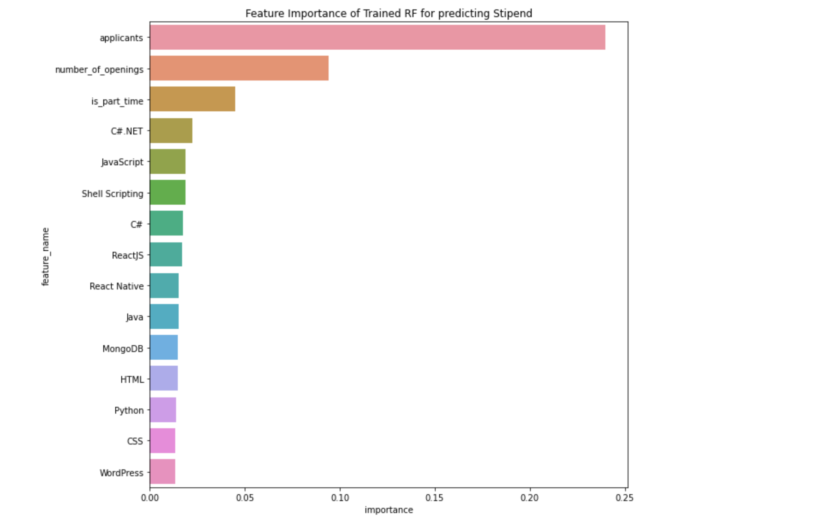

# Crawling and Analysis of Internship & Job Portal - Internshala and Monster India.

## Introduction
The project explores internships and jobs in the current market. The dataset is built by scraping publically available web pages of leading websites, Internshala and Monster India, as well as merging well known public dataset - stackoverflow developer survey from the years 2015 to 2020. We have performed extensive data exploration, using various data science and data mining techniques. 

### Objectives
+ Build a high-quality dataset and develop an efficient data preprocessing pipeline 
+ Discover trends in current internships and job market 
+ Highlight the areas of potential growth and improvement 
+ Understand current demands in the software industry, detect anomalies

### About Libraries
Our data collection strategy primarily consists of crawling individual pages(using selenium and requests library) at a time, as within the limitations of the respective robot.txt file for the website, and downloading the html page. Strategy is discussed in depth in later sections.
We have used Python as our language of choice, following best practices, guidelines  and conventions. Jupyter notebook in a virtual environment for local modelling and exploration and Deep Note for Collaborative workspace.

#### Frameworks used in this projects are:
+ Pandas
+ Sklearn
+ MLextension
+ Numpy
+ Plotly
+ Matplotlib 
+ Seaborn

#### Few observations from exploring Internshala dataset

